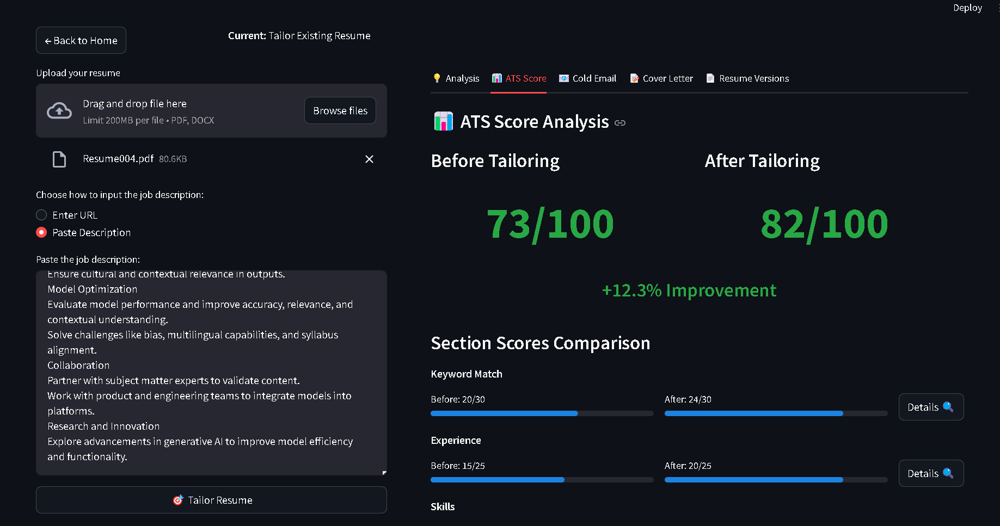

# 🎯 Job Ready AI- AI-Powered Job Application Suite

**Resume Tailor** is a comprehensive AI-powered platform that helps job seekers optimize their resumes, generate personalized cover letters, and analyze ATS compatibility. The platform features both a modern React frontend and a powerful Python backend with Streamlit support.



## ✨ Features

### 🎯 Core Functionality
- **Resume Analysis & Optimization**: Upload your resume and get AI-powered suggestions for improvement
- **Job-Specific Tailoring**: Automatically adapt your resume to match specific job descriptions
- **ATS Score Analysis**: Get detailed scoring on how well your resume performs with Applicant Tracking Systems
- **Cover Letter Generation**: Create personalized cover letters based on your resume and job requirements
- **Cold Email Templates**: Generate professional networking emails for job opportunities

### 🚀 Modern Frontend
- **React + TypeScript**: Modern, type-safe frontend with excellent developer experience
- **Responsive Design**: Optimized for desktop, tablet, and mobile devices
- **Smooth Animations**: Powered by Framer Motion for engaging user interactions
- **Glass Morphism UI**: Beautiful, modern design with light blue gradients
- **Real-time Feedback**: Toast notifications and loading states for better UX

### 🔧 Powerful Backend
- **AI-Powered Analysis**: Uses Groq's LLaMA models for intelligent resume processing
- **Multiple File Formats**: Supports PDF and DOCX resume uploads
- **Web Scraping**: Can analyze job descriptions from URLs or direct text input
- **Semantic Matching**: Advanced skill matching using sentence transformers
- **Document Generation**: Export optimized resumes in multiple formats

## 🛠️ Tech Stack

### Frontend
- **React 18** with TypeScript
- **Vite** for fast development and building
- **Tailwind CSS** for styling
- **Framer Motion** for animations
- **React Router** for navigation
- **React Hook Form** for form handling
- **Lucide React** for icons

### Backend
- **Python 3.8+**
- **Streamlit** for web interface
- **LangChain** for LLM integration
- **Groq API** for AI processing
- **SentenceTransformers** for semantic analysis
- **PyPDF2 & python-docx** for document processing
- **BeautifulSoup** for web scraping

## 📋 Prerequisites

Before you begin, ensure you have the following installed:

- **Node.js** (v16 or higher) - [Download here](https://nodejs.org/)
- **Python** (3.8 or higher) - [Download here](https://python.org/)
- **Git** - [Download here](https://git-scm.com/)
- **Groq API Key** - [Get your key here](https://console.groq.com/)

## 🚀 Installation & Setup

### 1. Clone the Repository

```bash
git clone https://github.com/yourusername/resume-tailor.git
cd resume-tailor
```

### 2. Backend Setup (Python/Streamlit)

#### Install Python Dependencies

```bash
# Create a virtual environment (recommended)
python -m venv myenv

# Activate virtual environment
# Windows:
myenv\Scripts\activate
# macOS/Linux:
source myenv/bin/activate

# Install dependencies
pip install -r requirements.txt
```

#### Configure Environment Variables

Create a `.env` file in the root directory:

```env
# Groq API Configuration
GROQ_API_KEY=your_groq_api_key_here

# Optional: Other API keys
OPENAI_API_KEY=your_openai_key_here
```

#### Run the Streamlit Backend

```bash
# Start the Streamlit app
streamlit run main.py

# The app will be available at http://localhost:8501
```

### 3. Frontend Setup (React)

#### Navigate to Frontend Directory

```bash
cd frontend
```

#### Install Node.js Dependencies

```bash
# Install all dependencies
npm install

# Or using yarn
yarn install
```

#### Configure Frontend Environment

Create a `.env` file in the `frontend` directory:

```env
# API Configuration
VITE_API_BASE_URL=http://localhost:8000
VITE_APP_NAME=Resume Tailor
```

#### Run the React Development Server

```bash
# Start the development server
npm run dev

# Or using yarn
yarn dev

# The frontend will be available at http://localhost:3000
```

## 🎮 How to Use

### Option 1: Streamlit Interface (Backend Only)

1. **Start the Application**:
   ```bash
   streamlit run main.py
   ```

2. **Choose Your Workflow**:
   - **Create New Resume**: Build a resume from scratch with AI guidance
   - **Tailor Existing Resume**: Optimize an existing resume for specific jobs

3. **Upload Your Resume**:
   - Drag and drop or browse for your PDF/DOCX resume file

4. **Provide Job Information**:
   - Paste a job description URL or enter the text directly

5. **Get Results**:
   - View your optimized resume
   - Check ATS compatibility score
   - Download cover letter and cold email templates

### Option 2: Modern React Frontend

1. **Start Both Servers**:
   ```bash
   # Terminal 1: Start backend
   streamlit run main.py
   
   # Terminal 2: Start frontend
   cd frontend && npm run dev
   ```

2. **Access the Application**:
   - Open your browser to `http://localhost:3000`
   - Enjoy the modern, responsive interface

3. **Use the Interface**:
   - Navigate through the beautiful UI
   - Upload resumes with drag-and-drop
   - View real-time progress and feedback
   - Download optimized documents

## 📁 Project Structure

```
resume-tailor/
├── 📁 backend/                 # Python backend files
│   ├── main.py                # Main Streamlit application
│   ├── resume_form.py         # Resume creation forms
│   ├── resume_generator.py    # Resume generation logic
│   ├── workflow_manager.py    # Workflow management
│   └── requirements.txt       # Python dependencies
├── 📁 frontend/               # React frontend
│   ├── 📁 src/
│   │   ├── 📁 components/     # Reusable UI components
│   │   ├── 📁 pages/          # Page components
│   │   ├── 📁 services/       # API service layer
│   │   ├── 📁 types/          # TypeScript definitions
│   │   ├── App.tsx            # Main app component
│   │   └── main.tsx           # Entry point
│   ├── package.json           # Node.js dependencies
│   └── vite.config.ts         # Vite configuration
├── 📁 templates/              # HTML templates
├── 📁 IMAGES/                 # Project images
├── .env                       # Environment variables
├── requirements.txt           # Python dependencies
└── README.md                  # This file
```

## 🔧 Development

### Running in Development Mode

```bash
# Start backend with auto-reload
streamlit run main.py --server.runOnSave=true

# Start frontend with hot reload
cd frontend && npm run dev
```

### Building for Production

```bash
# Build the frontend
cd frontend && npm run build

# The built files will be in frontend/dist/
```

### Available Scripts

#### Backend Scripts
```bash
# Run main application
streamlit run main.py

# Run with auto-reload
streamlit run main.py --server.runOnSave=true
```

#### Frontend Scripts
```bash
# Development server
npm run dev

# Build for production
npm run build

# Preview production build
npm run preview

# Lint code
npm run lint

# Fix linting issues
npm run lint:fix
```

## 🔐 API Configuration

### Groq API Setup

1. **Get Your API Key**:
   - Visit [Groq Console](https://console.groq.com/)
   - Sign up for an account
   - Navigate to API Keys section
   - Create a new API key

2. **Add to Environment**:
   ```bash
   # Add to your .env file
   GROQ_API_KEY=gsk_your_actual_api_key_here
   ```

3. **Verify Setup**:
   - The application will validate your API key on startup
   - You'll see an error message if the key is invalid

## 🎨 Customization

### Frontend Themes

The frontend uses Tailwind CSS with a custom theme. You can modify colors and styles in:

- `frontend/tailwind.config.js` - Tailwind configuration
- `frontend/src/index.css` - Global styles and custom utilities

### Backend Templates

Resume templates can be customized in:

- `templates/resume_template.html` - HTML resume template
- Modify the template to change styling and layout

## 🐛 Troubleshooting

### Common Issues

1. **"GROQ_API_KEY not found"**
   ```bash
   # Solution: Check your .env file
   echo $GROQ_API_KEY  # Should show your key
   ```

2. **Port already in use**
   ```bash
   # Find and kill process using port
   # Windows:
   netstat -ano | findstr :8501
   taskkill /PID <process_id> /F
   
   # macOS/Linux:
   lsof -ti:8501 | xargs kill
   ```

3. **Module not found errors**
   ```bash
   # Reinstall dependencies
   pip install -r requirements.txt --force-reinstall
   ```

4. **Frontend build issues**
   ```bash
   # Clear cache and reinstall
   cd frontend
   rm -rf node_modules package-lock.json
   npm install
   ```

### Performance Tips

- Use a virtual environment for Python dependencies
- Enable GPU acceleration if available
- Consider using Redis for caching (advanced)
- Optimize images in the `IMAGES/` directory

## 📝 Environment Variables Reference

### Backend (.env)
```env
# Required
GROQ_API_KEY=your_groq_api_key

# Optional
OPENAI_API_KEY=your_openai_key
DEBUG=true
LOG_LEVEL=INFO
```

### Frontend (frontend/.env)
```env
# API Configuration
VITE_API_BASE_URL=http://localhost:8000
VITE_APP_NAME=Resume Tailor

# Optional
VITE_DEBUG=true
VITE_ANALYTICS_ID=your_analytics_id
```

## 🚀 Deployment

### Frontend Deployment (Vercel/Netlify)

1. **Build the frontend**:
   ```bash
   cd frontend && npm run build
   ```

2. **Deploy to Vercel**:
   ```bash
   npm install -g vercel
   vercel --prod
   ```

3. **Deploy to Netlify**:
   ```bash
   npm install -g netlify-cli
   netlify deploy --prod --dir=dist
   ```

### Backend Deployment (Streamlit Cloud)

1. **Push to GitHub**
2. **Connect to Streamlit Cloud**
3. **Add environment variables in Streamlit settings**

## 🤝 Contributing

We welcome contributions! Please see our contributing guidelines:

1. **Fork the repository**
2. **Create a feature branch**: `git checkout -b feature-name`
3. **Make your changes**: Follow the coding standards
4. **Test thoroughly**: Ensure both frontend and backend work
5. **Submit a pull request**: Describe your changes clearly

### Development Guidelines

- Follow TypeScript best practices for frontend
- Use Python type hints for backend code
- Write clear commit messages
- Add tests for new features
- Update documentation as needed

## 📄 License

This project is licensed under the MIT License - see the [LICENSE](LICENSE) file for details.

## 🙏 Acknowledgments

- **Groq** for providing excellent LLM APIs
- **Streamlit** for the amazing web framework
- **React** and **Vite** for the modern frontend stack
- **Tailwind CSS** for beautiful styling
- **LangChain** for LLM integration tools

## 📞 Support

Having issues? Here's how to get help:

1. **Check the Troubleshooting section** above
2. **Search existing issues** on GitHub
3. **Create a new issue** with detailed information
4. **Join our community** discussions

## 🔗 Links

- **Live Demo**: [Coming Soon]
- **Documentation**: [GitHub Wiki]
- **Issues**: [GitHub Issues]
- **Discussions**: [GitHub Discussions]

---

**Built with ❤️ by the Resume Tailor Team**

*Helping job seekers land their dream jobs, one optimized resume at a time.*
